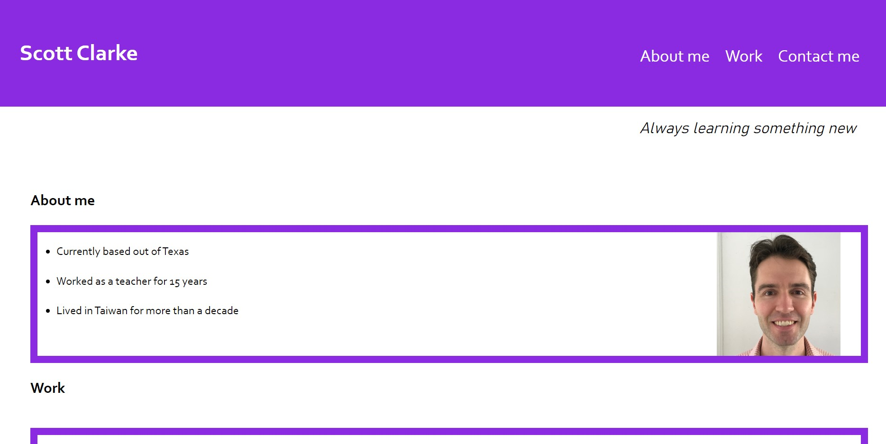

# scott-portfolio

## Description

This is my personal portfolio to display coding projects. It was built with HTML and CSS.

Since I currently have no programming work to display, I put in links to other online work I've done in the past year.

The links are to my:

- Teachers Pay Teachers Store
- fantasy basketball podcast
- Substack
- Movember page

I will replace these links with actual coding projects when I have projects to share.

Through making this webpage I:

- used CSS variables
- gained more experience with flexbox
- learned how to insert my own images
- got to insert some fun CSS "ease-in" effects

This project was written over a few days with the help of several classmates.

Finally, this project is incomplete. As I gain more coding experience, I plan on improving this webpage by:

- having the "work" images better fit within their purple box
- fixing the media queries so that "work" images actually get smaller
- add a hovering "tooltip" description for each of the four "work" images
- tighten up the margins and padding between the purple boxes so the webpage looks better overall

---

## Installation

This personal portfolio page can be viewed online at:

[scott-portfolio](https://scott-j-clarke.github.io/scott-portfolio/)

---

## Usage

Look at this website homepage through Chrome "developer tools" to learn a little about HTML and CSS. 

---

## Credits

Thank you to Amber Diehl for organizing our study group!

Thank you to Matteo Ramazzini for teaching me the CSS "ease-in" effects!

---

## License

MIT

---

## Screenshot

---