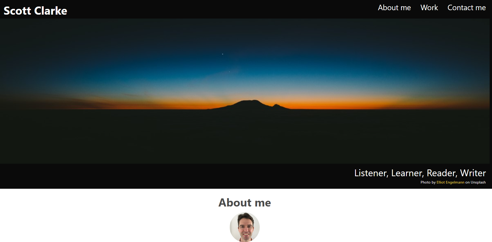

# scott-portfolio

## Description

The main purpose of this portfolio is to display my coding projects. 

It was built with HTML, Bulma, and some custom CSS.

I have linked five projects:

- "Daily Dose of Tech" is a blog-style, full stack web application, using the MVC framework
- "Note Taker" is meant for a user to write, save, and review notes
- "Logo Generator" lets a user make a customized logo
- "What's the Weather?" informs users about weather conditions around the world
- "Working Day Calendar" allows a user to track and tackle their daily to-do list

Through building this portfolio, I:

- gained experience using Bulma
- better understand how to add-in custom CSS
- received some helpful design and layout advice from a TA

---

## Installation

This portfolio can be viewed online at:

[scott-portfolio](https://scott-j-clarke.github.io/scott-portfolio/)

---

## Usage

If you are new to coding, look at this portfolio using Chrome's "Developer tools" to gain insights into how HTML, Bulma, and CSS interact with each other.

---

## Credits

Thank you Tye for your design and layout advice!

Thank you Amber for organizing our weekly study group!

Thank you Matteo for teaching me the CSS "ease-in" effects!

All photos from Unsplash have been credited on the portfolio page.

---

## License

MIT

---

## Screenshot

